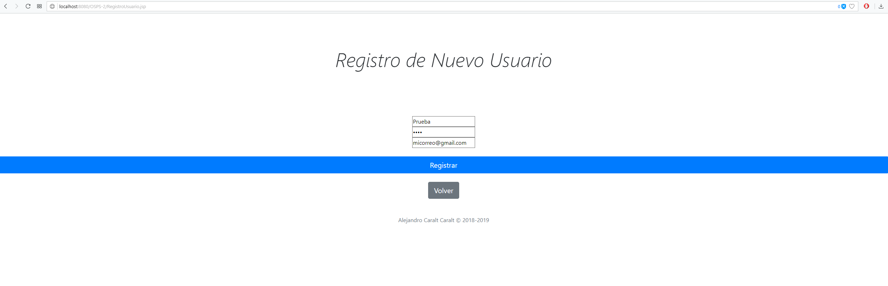

# CRUD con JSP Segunda entrega
Trabajo de Alejandro Caralt Caralt.
# Open Source Programming Studio
Un estudio de programación online donde se podran gestionar los proyecto open source del momento y crear nuevos proyectos donde todo el mundo puede apuntarse a cualquier proyecto, donde se indicaran algunas cosas básicas como el lenguaje del proyecto y el repositorio de github.

# Log-in 

## He añadido una identificación del usuario admin.
## SegundaEntrega- He añadido una funcionalidad a la aplicación para que diferencie entre el usuario admin y los demas. 

# Registro de Usuario

## El registro toma en cuenta un nickname único en la base de datos.
## SegundaEntrega - He optimizado las consultas y el código. Hay un nuevo sistema de registro de usuarios implementada solo al usuario "admin".

# Página Principal
 
## Se muestran las dos tablas y opciones para añadir o modificarlas, exceptuando en la tabla de usuario que no se puede modificar.
## SegundaEntrega - He añadido una página principal extra, una para el administrador donde se podran modificar proyectos y otra donde los usuarios podran suscribirse a nuevos proyectos. (esta funcionalidad no esta implementada por un fallo en la integración con el hashmap)

# Página Proyecto

## Realiza una consulta a la BBDD donde almacena los resultados en un "Hashmap<Proyecto,ArrayList<Usuario>>",  a la hora de cargar la información del proyecto selecciona usa la key y para la tabla de usuarios el array del value.

# Modificar Tabla de Proyectos

## Las modificaciones y las eliminaciones no se guardan, he encontrado varios fallos que no he podido solventar.
## SegundaEntrega - El nuevo sistema de modificación de proyecto esta solo implementada al usuario "admin". Se ha eliminado esta página.

# Alertas instantaneas
Se han añadido mensajes de información temporales para todas las funciones.
